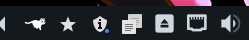
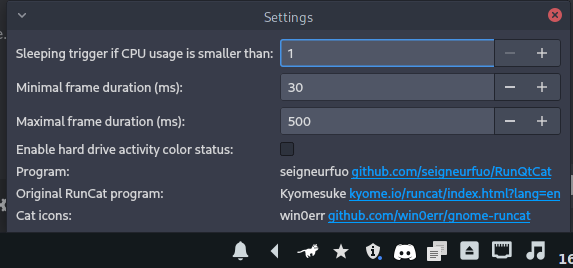

# RunQTCat





## Installation

1. Cloner le dépôt

2. Les image viennent du projet https://github.com/win0err/gnome-runcat
   Pour les récupérer:
   
   ```sh
   git submodule init
   git submodule update
   ```